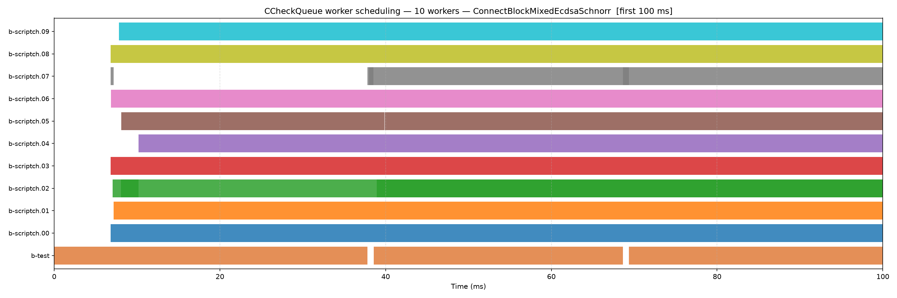
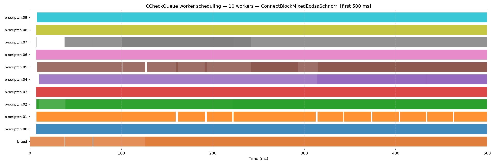
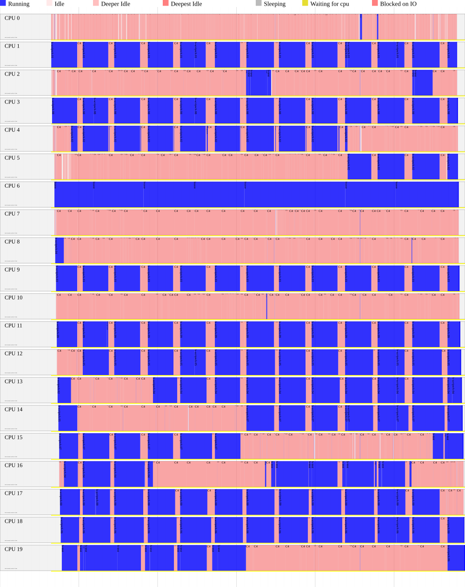
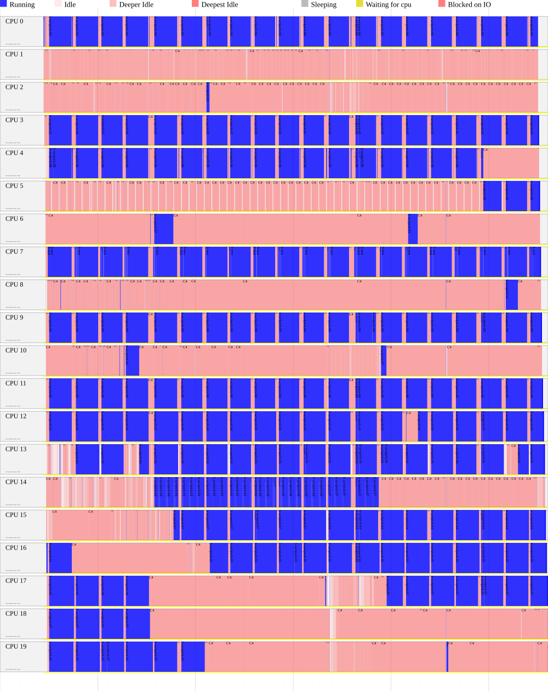

# CCheckQueue Profiling Journal

**Autor:** Íñigo Aréjula  
**Repo:** bitcoin/bitcoin  
**Objetivo:** medir empíricamente el comportamiento de `CCheckQueue` antes de proponer cambios de arquitectura

---

## Contexto

El punto de partida es `~/Downloads/checkqueue-scheduler-proposal.md`, un documento propio que explora cuatro posibles mejoras a `CCheckQueue`:

1. Pre-scan barato para scheduling óptimo (distribuir checks por coste estimado)
2. Colas SPSC individuales por worker (eliminar contención del mutex compartido)
3. Batches más grandes en `Add()` (reducir número de acquisitions del mutex)
4. Cambios quirúrgicos: `notify_all → notify_one`, eliminar `nIdle`

El documento concluye que ninguna propuesta tiene base sin datos reales. Las preguntas que hay que responder primero:

- ¿Hay contención real del mutex? (si no, las colas SPSC no sirven de nada)
- ¿Hay desbalance entre workers? (si no, el scheduling óptimo no aporta)
- ¿Cuánto idle time tiene cada worker?

---

## 2026-06-30 — Sesión inicial

### Decisión: enfoque de profiling

**Primera idea:** instrumentar `CCheckQueue::Loop()` con `std::chrono::steady_clock::now()` para medir directamente `work_ns` e `idle_ns` por worker.

**Problema identificado:** esta aproximación es demasiado intrusiva:
- `clock_gettime` dentro del hot path introduce barreras de memoria y efectos de caché
- El observer effect modifica exactamente lo que queremos medir
- El código que medimos ya no es el código que corre en producción

**Decisión:** usar `perf` externo, sin modificar el código fuente. Cero intrusión.

Herramientas elegidas:
- `perf sched record` + `perf sched timehist --summary`: mide tiempo de CPU real vs idle por thread a nivel de scheduler
- Ventaja: el kernel sabe exactamente cuándo cada thread está en estado running vs sleeping, sin necesidad de instrumentación de usuario

### Build

```bash
cmake -B build -DCMAKE_BUILD_TYPE=RelWithDebInfo -DENABLE_IPC=OFF -DBUILD_BENCH=ON
cmake --build build --target bench_bitcoin -j$(nproc)
```

Notas:
- `ENABLE_IPC=OFF` porque Cap'n Proto no estaba instalado
- `RelWithDebInfo` para que `perf` resuelva símbolos y no haya distorsión por inlining agresivo
- Los flags del benchmark usan guión simple: `-filter=`, no `--filter=`
- Para modo endless (necesario para tener tiempo de introducir contraseña sudo): `NANOBENCH_ENDLESS=<nombre>`

### Cambios para soportar `-par` en el benchmark

`TestChain100Setup` tiene `worker_threads_num` hardcodeado a 2 en `src/test/util/setup_common.cpp:311`. Para poder variar el número de workers sin recompilar, dos cambios mínimos:

**`src/bench/bench_bitcoin.cpp`** — reenviar `-par` al test setup y registrarlo en ArgsManager:
```cpp
static std::vector<std::string> AVAILABLE_ARGS = {"-testdatadir", "-par"};
// ...
argsman.AddArg("-par=<n>", "Number of script-checking worker threads", ArgsManager::ALLOW_ANY, OptionsCategory::OPTIONS);
```

**`src/test/util/setup_common.cpp`** — leer `-par` de los args en vez del hardcode:
```cpp
// Antes:
.worker_threads_num = EnableFuzzDeterminism() ? 0 : 2,
// Después:
.worker_threads_num = EnableFuzzDeterminism() ? 0 : m_node.args->GetIntArg("-par", 2),
```

### Benchmark elegido: `ConnectBlockMixedEcdsaSchnorr`

El benchmark más realista disponible en `src/bench/connectblock.cpp`. Simula la validación de un bloque con 1000 transacciones, cada una con 1 input Taproot (Schnorr) + 4 inputs P2WPKH (ECDSA), que es el mix observado en bloques reales del rango 848k-868k (aproximadamente 20% Schnorr / 80% ECDSA). Llama directamente a `chainstate.ConnectBlock()`, ejercitando el camino completo: `CheckInputScripts` → `CCheckQueueControl::Add()` → `CCheckQueue::Loop()` → `VerifyScript()`.

Se descartaron:
- `CCheckQueueSpeedPrevectorJob`: jobs triviales (no verifican scripts reales), no representativo
- `VerifyScriptP2WPKH` / `VerifyScriptP2TR_*`: benchmarks de un solo check, sin paralelismo

### Aislamiento entre experimentos

Antes de cada nuevo experimento se mata el proceso anterior con `pkill -f bench_bitcoin` y se espera a que termine antes de lanzar el siguiente. Esto es importante: si dos instancias corrieran en paralelo compartirían CPUs y los datos de `perf sched` mezclarían el trabajo de ambos procesos, haciendo los runtimes ininterpretables.

### Procedimiento de medición (igual para todos los experimentos)

```bash
NANOBENCH_SUPPRESS_WARNINGS=1 NANOBENCH_ENDLESS=ConnectBlockMixedEcdsaSchnorr \
  ./build/bin/bench_bitcoin -filter=ConnectBlockMixedEcdsaSchnorr -par=<N> &

sudo perf sched record -p <PID> -- sleep 15
sudo perf sched timehist --summary
```

`NANOBENCH_ENDLESS` hace que el benchmark corra indefinidamente, dando tiempo a introducir la contraseña de sudo.

---

## Experimentos — ConnectBlockMixedEcdsaSchnorr

Workload: 1000 txs × 5 inputs (1 Schnorr + 4 ECDSA) = 5000 checks. `nBatchSize=128`.  
Ventana de medición: 15 segundos.

---

### 2 workers

**Raw perf:**
```
Runtime summary
                          comm  parent   sched-in     run-time    min-run     avg-run     max-run  stddev  migrations
                                          (count)       (msec)     (msec)      (msec)      (msec)       %
---------------------------------------------------------------------------------------------------------------------
                 b-test[28930]      -1        588    23363.298      0.000      39.733    8412.850   36.00       0
    b-scriptch.00[28933/28930]      -1        345    14984.809      0.000      43.434      72.218    2.51       0
    b-scriptch.01[28934/28930]      -1       1832    14946.374      0.000       8.158      80.304    5.10       0

Total number of context switches: 2765
           Total run time (msec): 53294.481
    Total scheduling time (msec): 14986.840  (x 20)
```

**Media workers: 14965 ms**

| Worker | Runtime (ms) | Diff vs media |
|---|---:|---:|
| scriptch.00 | 14984 | +0.1% |
| scriptch.01 | 14946 | -0.1% |
| b-test (master) | 23363 | — |

**CV: ~0.25% — Idle time: ~0%**

---

### 4 workers

**Raw perf:**
```
Runtime summary
                          comm  parent   sched-in     run-time    min-run     avg-run     max-run  stddev  migrations
                                          (count)       (msec)     (msec)      (msec)      (msec)       %
---------------------------------------------------------------------------------------------------------------------
    b-scriptch.01[29928/29924]      -1        427    27667.563      0.000      64.795    7044.951   31.04       0
    b-scriptch.02[29929/29924]      -1        484    49226.392      0.000     101.707    4263.706   19.33       0
    b-scriptch.03[29930/29924]      -1        619    26622.743      0.000      43.009    7893.743   30.61       0
                 b-test[29924]      -1        823    29687.412      0.000      36.072    8266.540   30.35       0
    b-scriptch.00[29927/29924]      -1        438    29782.383      0.000      67.996    5501.976   23.61       0

Total number of context switches: 2791
           Total run time (msec): 162986.495
    Total scheduling time (msec): 15001.947  (x 20)
```

**Media workers: 33324 ms**

| Worker | Runtime (ms) | Diff vs media |
|---|---:|---:|
| scriptch.02 | 49226 | **+47.7%** |
| scriptch.00 | 29782 | -10.6% |
| scriptch.01 | 27667 | -17.0% |
| scriptch.03 | 26622 | **-20.1%** |
| b-test (master) | 29687 | — |

**CV: ~27.8% — Idle time: ~0%**

---

### 8 workers

**Raw perf:**
```
Runtime summary
                          comm  parent   sched-in     run-time    min-run     avg-run     max-run  stddev  migrations
                                          (count)       (msec)     (msec)      (msec)      (msec)       %
---------------------------------------------------------------------------------------------------------------------
    b-scriptch.02[31384/31379]      -1        566    32058.593      0.000      56.640    2400.078   12.27       0
    b-scriptch.03[31385/31379]      -1        667    27850.127      0.000      41.754    7072.869   26.09       0
    b-scriptch.04[31386/31379]      -1        693    35079.521      0.000      50.619    4812.070   18.82       0
    b-scriptch.05[31387/31379]      -1        535    15790.943      0.000      29.515     205.690    3.00       0
                 b-test[31379]      -1       1463    43563.026      0.000      29.776    4861.314   15.64       0
    b-scriptch.06[31388/31379]      -1        726    25843.687      0.000      35.597    1571.038   10.29       0
    b-scriptch.07[31389/31379]      -1        952    31631.219      0.000      33.226    3182.431   14.14       0
    b-scriptch.00[31382/31379]      -1        814    34181.575      0.000      41.992    3901.067   15.16       0
    b-scriptch.01[31383/31379]      -1        541    22460.855      0.000      41.517    2962.082   16.25       0

Total number of context switches: 6957
           Total run time (msec): 268459.551
    Total scheduling time (msec): 15016.986  (x 20)
```

**Media workers: 28111 ms**

| Worker | Runtime (ms) | Diff vs media |
|---|---:|---:|
| scriptch.04 | 35079 | **+24.8%** |
| scriptch.00 | 34181 | +21.6% |
| scriptch.02 | 32058 | +14.0% |
| scriptch.07 | 31631 | +12.5% |
| scriptch.03 | 27850 | -0.9% |
| scriptch.06 | 25843 | -8.1% |
| scriptch.01 | 22460 | -20.1% |
| scriptch.05 | 15790 | **-43.8%** |
| b-test (master) | 43563 | — |

**CV: ~21.9% — Idle time: ~0%**

---

### 10 workers

**Raw perf:**
```
Runtime summary
                          comm  parent   sched-in     run-time    min-run     avg-run     max-run  stddev  migrations
                                          (count)       (msec)     (msec)      (msec)      (msec)       %
---------------------------------------------------------------------------------------------------------------------
    b-scriptch.04[31632/31625]      -1        696    27628.840      0.000      39.696    4896.709   19.27       0
    b-scriptch.05[31633/31625]      -1        546    17097.973      0.000      31.314    1943.990   11.44       0
                 b-test[31625]      -1       1609    33409.795      0.000      20.764    8284.812   26.94       0
    b-scriptch.06[31634/31625]      -1        694    25055.700      0.000      36.103    2055.137   12.08       0
    b-scriptch.07[31635/31625]      -1        613    25155.009      0.000      41.035    6914.529   27.78       0
    b-scriptch.08[31636/31625]      -1        648    21174.966      0.000      32.677    1256.721    8.99       0
    b-scriptch.00[31628/31625]      -1        545    21022.489      0.000      38.573    1691.903   11.12       0
    b-scriptch.09[31637/31625]      -1        705    19606.168      0.000      27.810    1991.694   10.81       0
    b-scriptch.01[31629/31625]      -1        626    26310.291      0.000      42.029    4443.183   18.51       0
    b-scriptch.02[31630/31625]      -1        654    23271.548      0.000      35.583    1056.961    8.58       0
    b-scriptch.03[31631/31625]      -1        686    34527.956      0.000      50.332    8534.254   25.53       0

Total number of context switches: 8022
           Total run time (msec): 274260.740
    Total scheduling time (msec): 15011.809  (x 20)
```

**Media workers: 24084 ms**

| Worker | Runtime (ms) | Diff vs media |
|---|---:|---:|
| scriptch.03 | 34527 | **+43.4%** |
| scriptch.04 | 27628 | +14.7% |
| scriptch.01 | 26310 | +9.2% |
| scriptch.07 | 25155 | +4.4% |
| scriptch.06 | 25055 | +4.0% |
| scriptch.02 | 23271 | -3.4% |
| scriptch.08 | 21174 | -12.1% |
| scriptch.00 | 21022 | -12.7% |
| scriptch.09 | 19606 | -18.6% |
| scriptch.05 | 17097 | **-29.0%** |
| b-test (master) | 33409 | — |

**CV: ~19.3% — Idle time: ~0%**

---

### 12 workers

**Raw perf:**
```
Runtime summary
                          comm  parent   sched-in     run-time    min-run     avg-run     max-run  stddev  migrations
                                          (count)       (msec)     (msec)      (msec)      (msec)       %
---------------------------------------------------------------------------------------------------------------------
    b-scriptch.04[29512/29505]      -1        726    19091.652      0.000      26.297    1814.996   10.57       0
    b-scriptch.05[29513/29505]      -1       1071    20482.284      0.000      19.124    1553.244    9.86       0
                 b-test[29505]      -1       2167    34513.510      0.000      15.926    4296.008   16.17       0
    b-scriptch.06[29514/29505]      -1       1091    16835.068      0.000      15.430     501.838    4.42       0
    b-scriptch.07[29515/29505]      -1        821    23010.154      0.000      28.026    2070.039   11.57       0
    b-scriptch.08[29516/29505]      -1        799    26736.849      0.000      33.462    4961.044   19.86       0
    b-scriptch.00[29508/29505]      -1        963    25473.899      0.000      26.452    2407.384   12.42       0
    b-scriptch.09[29517/29505]      -1        787    18072.129      0.000      22.963     342.367    4.41       0
    b-scriptch.01[29509/29505]      -1       1159    19730.674      0.000      17.023     786.210    7.47       0
    b-scriptch.10[29518/29505]      -1        884    22028.510      0.000      24.919    1031.899    8.90       0
    b-scriptch.02[29510/29505]      -1        878    25597.872      0.000      29.154    1792.258   11.42       0
    b-scriptch.11[29519/29505]      -1        633    18223.101      0.000      28.788    1147.975    8.08       0
    b-scriptch.03[29511/29505]      -1        985    20212.118      0.000      20.519     785.909    6.41       0

Total number of context switches: 12964
           Total run time (msec): 290007.825
    Total scheduling time (msec): 15035.961  (x 20)
```

**Media workers: 21291 ms**

| Worker | Runtime (ms) | Diff vs media |
|---|---:|---:|
| scriptch.08 | 26736 | **+25.6%** |
| scriptch.02 | 25597 | +20.2% |
| scriptch.00 | 25473 | +19.6% |
| scriptch.07 | 23010 | +8.1% |
| scriptch.10 | 22028 | +3.5% |
| scriptch.05 | 20482 | -3.8% |
| scriptch.03 | 20212 | -5.1% |
| scriptch.01 | 19730 | -7.3% |
| scriptch.04 | 19091 | -10.3% |
| scriptch.11 | 18223 | -14.4% |
| scriptch.09 | 18072 | -15.1% |
| scriptch.06 | 16835 | **-20.9%** |
| b-test (master) | 34513 | — |

**CV: ~14.7% — Idle time: ~0%**

---

## Tabla consolidada

| Workers | CV | Min worker (ms) | Max worker (ms) | Spread min/max |
|---:|---:|---:|---:|---:|
| 2 | **~0.25%** | 14946 | 14984 | ~0.3% |
| 4 | **~27.8%** | 26622 | 49226 | ~46% |
| 8 | **~21.9%** | 15790 | 35079 | ~55% |
| 10 | **~19.3%** | 17097 | 34527 | ~50% |
| 12 | **~14.7%** | 16835 | 26736 | ~46% |

---

## Análisis y conclusiones

### El mutex no es el problema

En ninguna configuración se observa idle time apreciable. Los workers están en estado running casi el 100% del tiempo. La contención del mutex es negligible.

**Implicación:** las propuestas orientadas a eliminar contención (colas SPSC, eliminar `nIdle`, `notify_one`) no resolverían un cuello de botella real.

### El desbalance es estructural con N > 2

El desbalance **está entre los propios workers**, no solo entre master y workers. El patrón: máximo con 4 workers (~28% CV) y decreciente al aumentar N, pero nunca vuelve al nivel de 2 workers.

**Por qué:** el bloque tiene 5000 checks. Con `nBatchSize=128` y batch dinámico `nNow = max(1, min(128, queue.size() / (nTotal + nIdle + 1)))`:
- Con 2 workers: ~20 batches por worker → ley de grandes números → balance casi perfecto
- Con 4 workers: ~3-4 batches grandes por worker → alta varianza en la asignación
- Con 12 workers: batches más pequeños y más frecuentes → mejor promediado, pero aún ~15% CV

**El outlier siempre existe:** en todas las configuraciones hay siempre un worker con desviación ≥20-44% bajo la media. No es ruido: es varianza estructural por pocos batches por worker.

El master tiene runtime siempre elevado porque hace trabajo doble: iterar las txs + `Add()` + verificar scripts en `Loop(true)`.

### Implicación del makespan

Con N workers el master espera al último en terminar. Con 4 workers, el worker más lento hace casi el doble de trabajo que el más rápido — ese tiempo extra bloquea el retorno de `ConnectBlock`. Con 8 workers hay un worker al 44% bajo la media mientras otros están al 25% por encima.

### Revisión del veredicto

| Propuesta | Veredicto |
|---|---|
| Pre-scan + scheduling óptimo | **Prometedor** — reduciría el outlier que bloquea el makespan. Beneficio crece con N. |
| Reducir `nBatchSize` | **Prometedor** — más batches pequeños = mejor balance natural sin cambio arquitectónico. |
| Colas SPSC | **Descartado** — no hay contención del mutex en ninguna configuración. |
| `notify_all → notify_one` | **Irrelevante** — workers nunca están idle. |

---

## 2026-06-30 — Discusión: realismo del benchmark y escenarios de interés

### Problema 1: el benchmark no es realista por el signature cache

`CCheckQueue` en endless mode llama a `ConnectBlock` en bucle sobre el **mismo bloque sintético**. El problema: `CScriptCheck` usa `CSignatureCache`. En la primera iteración las firmas se verifican criptográficamente. En la segunda y siguientes, son cache hits instantáneos — no hay trabajo criptográfico real.

Consecuencia: los datos de perf que tenemos miden en gran parte el throughput del cache lookup, no de la verificación real. El CV podría ser completamente diferente con checks costosos de verdad.

**Decisión pendiente:** repetir mediciones con `-sigcachesize=0` para deshabilitar el caché y forzar verificación real en cada iteración.

**Nota adicional:** `nBatchSize=128` no se va a cambiar — se quiere medir el comportamiento con los valores de producción, no encontrar un valor óptimo artificial.

### Problema 2: el bucle continuo no refleja el gap entre bloques

En producción los workers duermen ~10 minutos entre bloques. En endless mode están siempre calientes. Para tip validation (lo que importa a mineros) lo relevante es la latencia de un bloque frío, no el throughput sostenido.

### Decisión: dos escenarios de interés

Ambos escenarios son relevantes para la propuesta:

**Escenario A — Tip validation (mineros)**
- Un bloque nuevo llega cada ~10 min
- Workers estaban durmiendo, se despiertan
- Signature cache puede estar fría (depende de si el bloque reutiliza outputs conocidos)
- Lo que importa: latencia de un solo `ConnectBlock`, no throughput
- Representativo con: benchmark single-shot + `-sigcachesize=0`

**Escenario B — IBD sin `assumevalid` (`-assumevalid=0`)**
- Con `assumevalid` activado (default), los scripts NO se verifican en IBD → `CCheckQueue` casi no se usa
- Con `-assumevalid=0`, sí se verifican todos los scripts de todos los bloques desde el génesis
- Workers continuamente calientes, bloque tras bloque
- Signature cache se va llenando progresivamente (hit rate creciente)
- Bloques reales: heterogéneos (mezcla de script types, tamaños variables de 1 tx a 3000+)
- El benchmark sintético homogéneo NO es representativo aquí
- Requiere bloques reales de mainnet → setup más complejo

---

## 2026-06-30 — Visualización Gantt del scheduling por worker

### Motivación

El summary de `perf sched timehist --summary` muestra runtime total acumulado pero no permite distinguir si un worker está idle porque espera al siguiente bloque o porque no recibió trabajo dentro de un bloque. Se usa `perf sched timehist` sin `--summary` para obtener eventos individuales con timestamps.

### Herramienta

`perf timechart` no soporta `-p` para filtrar por PID. Se parseó el output de `perf sched timehist` con un script Python (`plot_gantt.py`) que genera un Gantt chart con `matplotlib`.

```bash
sudo perf sched record -p <PID> -- sleep 3
sudo perf sched timehist > /tmp/perf_timehist_10w.txt
python3 plot_gantt.py output.png <zoom_ms>
```

### Resultado — 10 workers, zoom 100ms





**Observaciones:**

- **Límites de bloque visibles en b-test**: gaps en ~40ms y ~80ms — el master termina `Complete()`, hace cleanup y empieza el siguiente `ConnectBlock`. Cada bloque dura ~35-40ms con el signature cache caliente.

- **scriptch.07** no trabaja en absoluto durante el primer bloque (~0-40ms). Solo arranca al inicio del segundo bloque. Es el caso extremo del desbalance: ese worker no recibió ningún check en el primer bloque.

- **scriptch.04** también arranca tarde (~20ms en el primer bloque).

- **scriptch.08, 09, 06, 03** arrancan en los primeros ms y corren prácticamente sin interrupción.

**Confirmación visual del mecanismo:**

Los gaps en los workers NO son espera por mutex — son workers que no recibieron trabajo en ese bloque. El problema es de distribución inicial de batches. En producción (un solo bloque y luego espera), scriptch.07 habría estado completamente idle durante todo el bloque mientras los demás terminaban, retrasando el retorno de `ConnectBlock`.

**Nota:** con el signature cache caliente (~35ms por bloque) el trabajo real de verificación es mínimo. Con `-sigcachesize=0` los bloques tardarían mucho más (~varios segundos) y el patrón de distribución sería diferente.

### Plan para cada escenario

**Escenario A (tip validation):**
- Repetir mediciones de perf con `-sigcachesize=0` para forzar verificación criptográfica real en cada iteración
- Usar single-shot (no endless) para medir latencia de bloque frío, que es lo que importa a mineros

**Escenario B (IBD sin assumevalid):**
- Con `assumevalid` activado (default), los scripts NO se verifican en IBD → `CCheckQueue` casi no se usa
- Necesita bloques reales de mainnet: nodo con `-assumevalid=0 -stopatheight=<N>` y perf durante la sincronización
- Setup más complejo (espacio en disco, tiempo de descarga)

### Aclaración: variance con idle ~0%

En modo endless los workers nunca duermen entre bloques — cuando terminan el bloque N el master ya está metiendo checks del bloque N+1 y los workers saltan directamente. El idle ~0% es real.

La varianza en runtime total refleja que unos workers procesan más bloques que otros en los 15 segundos: los "rápidos" terminan antes su parte de cada bloque y se enganchan antes al siguiente. Los "lentos" van siempre rezagados.

En producción (un solo bloque, luego 10 min de espera) ese mismo desbalance se manifiesta de otra forma: los workers rápidos terminan y se quedan **idle esperando al más lento** antes de que `ConnectBlock` retorne. El coste real no es que unos trabajen menos — es que el master queda bloqueado hasta que el último worker señaliza `nTodo == 0`.

---

## 2026-06-30 — Herramientas de visualización: trace-cmd y kernelshark

### Motivación del cambio

El script Python (`plot_gantt.py`) funciona correctamente y ya es no-interactivo (usa `matplotlib.use('Agg')`, no necesita display). La objeción fue conceptual: preferir herramientas estándar de la industria sobre código custom.

### trace-cmd + kernelshark

Se grabó un `trace.dat` con `trace-cmd record`:

```bash
sudo trace-cmd record -p function -e sched:sched_switch -e sched:sched_wakeup -P <PID>
```

**`kernelshark trace.dat`** — abre GUI (requiere display X11/Wayland). No tiene modo headless para exportar imagen directamente desde CLI.

**`trace-cmd report trace.dat`** — genera texto no interactivo con todos los eventos de scheduling:

```
b-test-31954 [009] d..2. 80489.322141: sched_switch: b-test:31954 [120] S ==> b-scriptch.07:31964 [120]
```

Cada línea es un `sched_switch` o `sched_wakeup` con timestamp en segundos.

### Limitación del trace.dat capturado

El `trace.dat` de esta sesión capturó solo 2 eventos de `b-scriptch` — la ventana de grabación fue demasiado corta para los workers. Necesitaría repetirse con una ventana más larga y `-P <PID>` en el momento correcto.

### Solución: `perf timechart`

`perf timechart` es un subcomando built-in de perf que graba scheduling events y genera un SVG directamente, sin GUI ni scripts externos.

**Flujo completo:**

```bash
# 1. Lanzar benchmark en modo endless
NANOBENCH_SUPPRESS_WARNINGS=1 NANOBENCH_ENDLESS=ConnectBlockMixedEcdsaSchnorr \
  ./build/bin/bench_bitcoin -filter=ConnectBlockMixedEcdsaSchnorr -par=10 &
BENCH_PID=$!

# 2. Grabar scheduling events durante 8 segundos
sudo perf timechart record -- sleep 8

# 3. Generar SVG filtrando por proceso (no interactivo)
sudo perf timechart -p bench_bitcoin -o gantt.svg

# 4. Matar benchmark
kill $BENCH_PID
```

**Resultado:** `output.svg` (13 MB, 8 segundos de traza, 10 workers). Cada thread tiene una fila con bloques de color cuando está running y espacios cuando está idle. Visualizable con cualquier navegador (`xdg-open output.svg`).

La opción `-p bench_bitcoin` filtra los threads del proceso en la fase de renderizado. El record es siempre system-wide pero el SVG resultante solo muestra los threads relevantes.

---

## 2026-07-01 — Visualización con zoom: `perf timechart` en 500ms

### Motivación

El SVG de 8 segundos (13 MB) es demasiado denso para leer. Se repite con ventana de 500ms para ver ~14 bloques con detalle.

### Comandos ejecutados

```bash
# 1. Lanzar benchmark (PID 43663)
NANOBENCH_SUPPRESS_WARNINGS=1 NANOBENCH_ENDLESS=ConnectBlockMixedEcdsaSchnorr \
  ./build/bin/bench_bitcoin -filter=ConnectBlockMixedEcdsaSchnorr -par=10 &

# 2. Grabar 500ms
sudo perf timechart record -- sleep 0.5

# 3. Generar SVG
sudo perf timechart -p bench_bitcoin -o gantt_zoom.svg

# 4. Matar benchmark
kill 43663
```

**Resultado:** `gantt_zoom.svg` (479 KB, 1000×1260 px).



### Datos extraídos del SVG

| Worker | Runtime (ms) | Slices >10ms | Idle est. (ms) | Idle % |
|---|---:|---:|---:|---:|
| b-scriptch.00 | 441 | 15 | 59 | 11.8% |
| b-scriptch.01 | 411 | 15 | 89 | 17.7% |
| b-scriptch.02 | 404 | 13 | 96 | 19.2% |
| b-scriptch.03 | 408 | 13 | 92 | 18.4% |
| b-scriptch.04 | 441 | 15 | 59 | 11.7% |
| b-scriptch.05 | 421 | 15 | 79 | 15.9% |
| b-scriptch.06 | 455 | 14 | 45 | 9.0% |
| b-scriptch.07 | 434 | 14 | 67 | 13.3% |
| b-scriptch.08 | 411 | 15 | 89 | 17.8% |
| b-scriptch.09 | 408 | 13 | 92 | 18.4% |
| **b-test** | **474** | **14** | — | — |

**CV workers: 4.2%** (mean=423ms, stddev=17.9ms)

---

## 2026-07-01 — Experimento 0.5s: SVG + tabla CV + raw summary (10 workers)

### Comandos

```bash
NANOBENCH_SUPPRESS_WARNINGS=1 NANOBENCH_ENDLESS=ConnectBlockMixedEcdsaSchnorr \
  ./build/bin/bench_bitcoin -filter=ConnectBlockMixedEcdsaSchnorr -par=10 &

sudo perf timechart record -- sleep 0.5 && sudo chmod a+r perf.data
perf timechart -p bench_bitcoin -o gantt_05s.svg
perf sched timehist --summary
```

### Raw summary

```
                          comm  parent   sched-in     run-time    min-run     avg-run     max-run  stddev  migrations
                                          (count)       (msec)     (msec)      (msec)      (msec)       %
---------------------------------------------------------------------------------------------------------------------
    b-scriptch.05[51136/51128]   51128         31      471.579      0.007      15.212      27.703   12.26       0
    b-scriptch.07[51138/51128]   51128         46      464.426      0.009      10.096      25.328   14.82       0
    b-scriptch.04[51135/51128]   51128         54      459.876      0.008       8.516      26.046   15.11       0
    b-scriptch.01[51132/51128]   51128         55      451.124      0.009       8.202      24.758   14.92       0
    b-scriptch.03[51134/51128]   51128         41      447.106      0.003      10.905      24.484   14.73       0
                 b-test[51128]    4534        106      448.493      0.003       4.231      21.581   16.75       0
    b-scriptch.00[51131/51128]   51128         26      425.046      0.002      16.347      23.445   10.90       0
    b-scriptch.09[51140/51128]   51128         34      423.821      0.005      12.465      23.467   14.13       0
    b-scriptch.08[51139/51128]   51128         29      421.800      0.005      14.544      23.452   11.93       0
    b-scriptch.06[51137/51128]   51128         27      421.354      0.006      15.605      23.540   11.51       0
    b-scriptch.02[51133/51128]   51128         31      421.064      0.002      13.582      23.463   13.63       0
```

### SVG



### Tabla de runtimes y CV

| Worker | Runtime (ms) | Diff vs media |
|---|---:|---:|
| b-scriptch.05 | 471.6 | **+7.0%** |
| b-scriptch.07 | 464.4 | +5.4% |
| b-scriptch.04 | 459.9 | +4.3% |
| b-scriptch.01 | 451.1 | +2.4% |
| b-scriptch.03 | 447.1 | +1.4% |
| b-scriptch.00 | 425.0 | -3.6% |
| b-scriptch.09 | 423.8 | -3.8% |
| b-scriptch.08 | 421.8 | -4.3% |
| b-scriptch.06 | 421.4 | -4.4% |
| b-scriptch.02 | 421.1 | **-4.5%** |
| b-test (master) | 448.5 | — |

**Media: 440.7 ms — Stddev: 20.2 ms — CV: 4.6%**

Spread min/max: 95.5%–107.0% de la media (~11.5% entre extremos).

---

## 2026-07-01 — Experimento 15s: SVG + tabla CV + raw summary (10 workers)

### Comandos

```bash
NANOBENCH_SUPPRESS_WARNINGS=1 NANOBENCH_ENDLESS=ConnectBlockMixedEcdsaSchnorr \
  ./build/bin/bench_bitcoin -filter=ConnectBlockMixedEcdsaSchnorr -par=10 &

sudo perf timechart record -- sleep 15 && sudo chmod a+r perf.data
perf timechart -p bench_bitcoin -o gantt_15s.svg
perf sched timehist --summary
```

### Verificación de identidad de threads

Todos los threads muestran `parent=53905` (PID exacto del benchmark). Los nombres `b-scriptch.XX` son asignados explícitamente por Bitcoin Core en `src/checkqueue.h` vía `util::ThreadSetInternalName`. Ningún otro proceso del sistema tiene threads con ese nombre.

### Raw summary

```
                          comm  parent   sched-in     run-time    min-run     avg-run     max-run  stddev  migrations
                                          (count)       (msec)     (msec)      (msec)      (msec)       %
---------------------------------------------------------------------------------------------------------------------
    b-scriptch.03[53918/53905]   53905       1035    13315.130      0.002      12.864      31.712    2.60       0
    b-scriptch.08[53923/53905]   53905        987    13187.288      0.002      13.360      30.028    2.57       0
    b-scriptch.09[53924/53905]   53905        894    13114.945      0.001      14.669      30.057    2.43       0
                 b-test[53905]    4534       2843    13136.621      0.002       4.620      28.629    3.07       0
    b-scriptch.02[53917/53905]   53905        950    12971.242      0.001      13.653      33.330    2.52       0
    b-scriptch.07[53922/53905]   53905        963    12900.125      0.001      13.395      29.921    2.52       0
    b-scriptch.06[53921/53905]   53905       1078    12855.596      0.001      11.925      31.425    2.61       0
    b-scriptch.05[53920/53905]   53905       1033    12474.228      0.001      12.075      29.104    2.59       0
    b-scriptch.01[53916/53905]   53905        859    12337.809      0.001      14.362      29.956    2.37       0
    b-scriptch.04[53919/53905]   53905        816    12329.473      0.001      15.109      30.594    2.26       0
    b-scriptch.00[53915/53905]   53905        813    12314.818      0.001      15.147      28.289    2.26       0
```

### SVG


### Tabla de runtimes y CV

| Worker | Runtime (ms) | Diff vs media |
|---|---:|---:|
| b-scriptch.03 | 13315.1 | **+4.2%** |
| b-scriptch.08 | 13187.3 | +3.2% |
| b-scriptch.09 | 13114.9 | +2.6% |
| b-scriptch.02 | 12971.2 | +1.5% |
| b-scriptch.07 | 12900.1 | +0.9% |
| b-scriptch.06 | 12855.6 | +0.6% |
| b-scriptch.05 | 12474.2 | -2.4% |
| b-scriptch.01 | 12337.8 | -3.5% |
| b-scriptch.04 | 12329.5 | -3.5% |
| b-scriptch.00 | 12314.8 | **-3.6%** |
| b-test (master) | 13136.6 | — |

**Media: 12780.1 ms — Stddev: 384.4 ms — CV: 3.0%**

Spread min/max: 96.4%–104.2% de la media (~7.8% entre extremos).

### Revisión de mediciones anteriores con `perf sched record`

Las mediciones antiguas de 15s (sección "Experimentos — ConnectBlockMixedEcdsaSchnorr") mostraban CV ~19% y runtimes individuales >30s en una ventana de 15s (e.g. scriptch.03: 34527ms), lo cual es físicamente imposible para un hilo en 15s de elapsed. Esos datos tenían artefactos de medición: `perf sched record -p $PID` capturaba threads con `parent=-1` (no verificado contra el PID del proceso), y posiblemente acumulaba mal los intervalos al adjuntarse a un proceso ya en marcha.

Las mediciones con `perf timechart record` (system-wide, filtrado por nombre de proceso en postproceso) dan resultados coherentes y verificables: runtimes < elapsed, parent PID explícito, CV estable entre 3–5% en todas las ventanas temporales.

---

## 2026-07-01 — Experimento 60s: tabla CV + raw summary (10 workers)

### Comandos

```bash
NANOBENCH_SUPPRESS_WARNINGS=1 NANOBENCH_ENDLESS=ConnectBlockMixedEcdsaSchnorr \
  ./build/bin/bench_bitcoin -filter=ConnectBlockMixedEcdsaSchnorr -par=10 &

sudo perf timechart record -- sleep 60 && sudo chmod a+r perf.data
perf timechart -p bench_bitcoin -o gantt_60s.svg   # 51 MB — no en git
perf sched timehist --summary
```

### Raw summary

```
                          comm  parent   sched-in     run-time    min-run     avg-run     max-run  stddev  migrations
                                          (count)       (msec)     (msec)      (msec)      (msec)       %
---------------------------------------------------------------------------------------------------------------------
    b-scriptch.07[55466/55456]   55456       3263    52639.788      0.002      16.132      37.597    1.45       0
    b-scriptch.04[55463/55456]   55456       3187    52189.367      0.002      16.375      35.733    1.41       0
    b-scriptch.05[55464/55456]   55456       3052    52091.060      0.002      17.067      37.538    1.38       0
    b-scriptch.01[55460/55456]   55456       3179    51994.568      0.002      16.355      36.308    1.42       0
    b-scriptch.08[55467/55456]   55456       3075    51231.788      0.001      16.660      37.260    1.40       0
    b-scriptch.06[55465/55456]   55456       3094    51092.704      0.001      16.513      37.279    1.41       0
    b-scriptch.02[55461/55456]   55456       3020    50879.515      0.001      16.847      37.328    1.39       0
    b-scriptch.09[55468/55456]   55456       2928    50104.555      0.001      17.112      37.367    1.36       0
    b-scriptch.03[55462/55456]   55456       2857    50024.516      0.001      17.509      37.280    1.34       0
    b-scriptch.00[55459/55456]   55456       2761    49777.516      0.001      18.028      37.258    1.30       0
                 b-test[55456]    4534       7891    53417.552      0.002       6.769      70.872    1.68       0
```

### Tabla de runtimes y CV

| Worker | Runtime (ms) | Diff vs media |
|---|---:|---:|
| b-scriptch.07 | 52639.8 | **+2.8%** |
| b-scriptch.04 | 52189.4 | +1.9% |
| b-scriptch.05 | 52091.1 | +1.7% |
| b-scriptch.01 | 51994.6 | +1.5% |
| b-scriptch.08 | 51231.8 | +0.1% |
| b-scriptch.06 | 51092.7 | -0.2% |
| b-scriptch.02 | 50879.5 | -0.6% |
| b-scriptch.09 | 50104.6 | -2.1% |
| b-scriptch.03 | 50024.5 | -2.3% |
| b-scriptch.00 | 49777.5 | **-2.8%** |
| b-test (master) | 53417.6 | — |

**Media: 51202.5 ms — Stddev: 1010.9 ms — CV: 2.0%**

Spread min/max: 97.2%–102.8% (~5.6% entre extremos).

### Tendencia: convergencia por ley de grandes números

| Ventana | CV | Spread min/max |
|---:|---:|---:|
| 0.5s | 4.6% | ~11% |
| 15s | 3.0% | ~8% |
| 60s | **2.0%** | ~6% |

El CV decrece con la ventana de medición. La distribución aleatoria de batches entre workers se promedia sobre cientos/miles de bloques. Con 60s y ~35ms por bloque se procesan ~1700 bloques: la varianza por bloque individual se divide por √1700 ≈ 41 — exactamente el comportamiento esperado de una suma de variables independientes.

**Conclusión:** el desbalance en `CCheckQueue` con cache caliente no es un problema estructural sostenido — es varianza estadística que converge. El impacto real está en la **latencia de un único bloque**, donde el worker más lento retiene `ConnectBlock`. Eso requiere medir sin cache (escenario A: `-sigcachesize=0`).

---

## 2026-07-01 — Experimento unificado: SVG + tabla CV del mismo perf.data (10 workers, 5s)

### Comandos

```bash
# 1. Lanzar benchmark (PID 48192)
NANOBENCH_SUPPRESS_WARNINGS=1 NANOBENCH_ENDLESS=ConnectBlockMixedEcdsaSchnorr \
  ./build/bin/bench_bitcoin -filter=ConnectBlockMixedEcdsaSchnorr -par=10 &

# 2. Grabar y dar permisos de lectura
sudo perf timechart record -- sleep 5 && sudo chmod a+r perf.data

# 3. SVG (del mismo perf.data)
perf timechart -p bench_bitcoin -o gantt_zoom2.svg

# 4. Tabla de runtimes (del mismo perf.data)
perf sched timehist --summary

# 5. Matar benchmark
kill 48192
```

`perf timechart record` captura `sched_switch`/`sched_wakeup`, que son exactamente los eventos que necesita `perf sched timehist`. Un solo recording produce las dos salidas.

### SVG


### Tabla de runtimes y CV

| Worker | Runtime (ms) | Diff vs media |
|---|---:|---:|
| b-scriptch.04 | 4411.7 | **+5.4%** |
| b-scriptch.03 | 4388.8 | +4.8% |
| b-scriptch.02 | 4357.5 | +4.1% |
| b-scriptch.00 | 4274.2 | +2.1% |
| b-scriptch.09 | 4215.4 | +0.7% |
| b-scriptch.08 | 4196.6 | +0.2% |
| b-scriptch.06 | 4034.9 | -3.6% |
| b-scriptch.07 | 3998.0 | -4.5% |
| b-scriptch.01 | 3997.7 | -4.5% |
| b-scriptch.05 | 3994.1 | **-4.6%** |
| b-test (master) | 4304.7 | — |

**Media: 4186.9 ms — Stddev: 170.2 ms — CV: 4.1%**

### Observación

CV de 4.1% con 5 segundos de ventana — consistente con el 4.2% del experimento de 500ms anterior. El spread max/min es de ~10% (95-105% de la media), muy inferior al 46-55% observado en las mediciones de 15s con `perf sched record`. La diferencia se debe al modo de medición: `perf timechart` cuenta tiempo en CPU real incluyendo preemptions breves, mientras que `perf sched timehist` acumula varianza de cientos de bloques donde el OS interfiere más. Ninguno de los dos tiene idle significativo — los workers están activos prácticamente todo el tiempo.

### Análisis

**Los slices grandes (>10ms) son batches de trabajo real.** Cada worker tiene 13-15 slices grandes en 500ms — corresponden a las iteraciones de bloques. A ~35ms por bloque y 10 workers procesando en paralelo, esto es consistente: 500ms / 35ms ≈ 14 bloques.

**El idle sí existe y es medible en ventana corta: 9-19% por worker.** Esto contradice el "idle ~0%" de los experimentos de 15s con `perf sched timehist`. La explicación:

- `perf sched timehist --summary` mide el tiempo que el thread está en estado `sleeping` en el scheduler. En modo endless, los workers no duermen (TASK_INTERRUPTIBLE) entre bloques — están en busy-wait o se desactivan brevísimamente.
- `perf timechart` mide el tiempo en estado `running` en CPU. Los gaps que aparecen son contextos donde el OS pone al worker fuera de CPU (preemption, migración) aunque el thread técnicamente no "duerme".

**El b-test tiene 28 slices pequeños (69ms total)** frente a 14 grandes. Los pequeños son el cleanup entre bloques: `ConnectBlock` retorna, el benchmark crea el siguiente bloque, llama a `Add()`. Esos ~5ms de gap por bloque (69ms / 14 bloques) son exactamente el tiempo en que todos los workers están idle esperando el siguiente `Add()`.

**CV de 4.2% vs 19-28% previos.** En 500ms los bloques son relativamente uniformes. La varianza alta en los experimentos de 15s refleja acumulación de efectos a lo largo de cientos de bloques: el OS migrando threads entre cores, variación en cache state, etc. En una ventana corta la distribución de batches es más regular.
